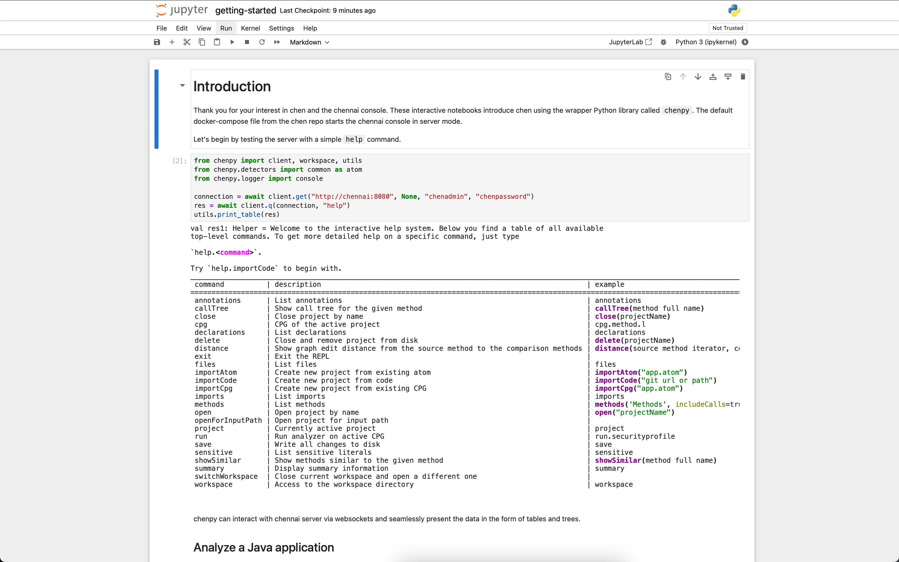
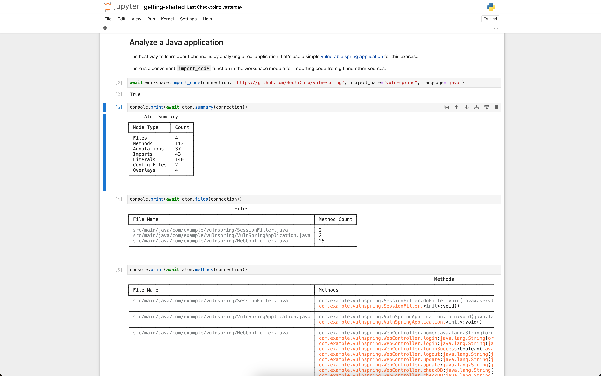

# chen

Code Hierarchy Exploration Net (chen) is an advanced exploration toolkit for your application source code and its dependency hierarchy. This repo contains the source code for chen library and an advanced REPL console called chennai (chen not AI).

## Requirements

- Java >= 21
- Python >= 3.10
- Node.js >= 20 (To run [atom](https://github.com/AppThreat/atom))
- Minimum 16GB RAM

## Getting started

chen container image has everything needed to get started.

### Jupyter notebook with docker compose

Use the docker compose from this repo to try chennai with Jupyter Notebook.

```shell
git clone https://github.com/AppThreat/chen
cd chen
docker compose up
```

- Navigate to the link "http://127.0.0.1:9999/tree?token=chennai"
- Click notebooks and then `getting-started.ipynb`

Use the controls in Jupyter to interact with the cells. For a preview via github click [here](./notebooks/getting-started.ipynb)




### Interactive console

To start the interactive console, run `chennai` command.

```shell
docker run --rm -v /tmp:/tmp -v $HOME:$HOME -v $(pwd):/app:rw -it ghcr.io/appthreat/chen chennai
```

### Chennai server mode

`chennai` could also be run as an HTTP server.

```shell
docker run --rm -v /tmp:/tmp -v $HOME:$HOME -v $(pwd):/app:rw -p 8080:8080 -it ghcr.io/appthreat/chen chennai --server
```

**Defaults:**

- Port 8080
- Username chenadmin
- Password chenpassword

## Local Installation

```shell
# Install atom and cdxgen
sudo npm install -g @appthreat/atom @cyclonedx/cdxgen --omit=optional

# Install chen from pypi
pip install appthreat-chen
```

To download the chen distribution.

```shell
chen --download
```

To generate custom graphs and models with atom for data science, download the scientific pack which installs support for the PyTorch ecosystem. [conda](https://docs.conda.io/projects/conda/en/stable/user-guide/install/index.html) is recommended for the best experience.

```shell
chen --download --with-science
```

Once the download finishes, the command will display the download location along with the environment variables that need to be set to invoke `chennai` console. Example output below:

```shell
[21:53:36] INFO     To run chennai console, add the following environment variables to your .zshrc or .bashrc:
export JAVA_OPTS="-Xmx16G"
export JAVA_TOOL_OPTIONS="-Dfile.encoding=UTF-8 -Djna.library.path=<lib dir>"
export SCALAPY_PYTHON_LIBRARY=python3.12
export CHEN_HOME=/home/user/.local/share/chen
export PATH=$PATH:/home/user/.local/share/chen/platform:/home/user/.local/share/chen/platform/bin:
```

It is important to set these environment variables without which the console commands would fail with errors.

## Running the console

Type `chennai` to launch the console.

```shell
chennai
```

```shell

 _                          _   _   _   _  __
/  |_   _  ._  ._   _. o   |_  / \ / \ / \  / |_|_
\_ | | (/_ | | | | (_| |   |_) \_/ \_/ \_/ /    |


Version: 0.0.7
Type `help` to begin


chennai>
```

## Sample commmands

### Help command

```shell
chennai> help
val res0: Helper = Welcome to the interactive help system. Below you find a table of all available
top-level commands. To get more detailed help on a specific command, just type

`help.<command>`.

Try `help.importCode` to begin with.
_______________________________________________________________________________________________________________________________________________________________
command          | description                                                               | example                                                       |
=============================================================================================================================================================|
annotations      | List annotations                                                          | annotations                                                   |
callTree         | Show call tree for the given method                                       | callTree(method full name)                                    |
close            | Close project by name                                                     | close(projectName)                                            |
declarations     | List declarations                                                         | declarations                                                  |
distance         | Show graph edit distance from the source method to the comparison methods | distance(source method iterator, comparison method iterators) |
exit             | Exit the REPL                                                             |                                                               |
files            | List files                                                                | files                                                         |
importAtom       | Create new project from existing atom                                     | importAtom("app.atom")                                        |
importCode       | Create new project from code                                              | importCode("example.jar")                                     |
imports          | List imports                                                              | imports                                                       |
methods          | List methods                                                              | methods('Methods', includeCalls=true, tree=true)              |
sensitive        | List sensitive literals                                                   | sensitive                                                     |
showSimilar      | Show methods similar to the given method                                  | showSimilar(method full name)                                 |
summary          | Display summary information                                               | summary                                                       |
reachables       | Show reachable flows from a source to sink. Default source: framework-input and sink: framework-output | reachables                       |
cryptos          | Show reachable flows from a source to sink. Default source: crypto-algorithm and sink: crypto-generate | cryptos                          |
```

Refer to the documentation site to learn more about the commands.

## Languages supported

- C/C++
- H (C/C++ Header files alone)
- Java (Requires compilation) - 8 to 21
- Jar
- Android APK (Requires Android SDK. Set the environment variable `ANDROID_HOME`)
- JavaScript
- TypeScript
- Python
- PHP (Requires PHP >= 7.0. Supports PHP 5.2 to 8.3)
- Ruby (Requires Ruby >= 3.4.0. Supports Ruby 1.8 - 3.3 syntax)

## Troubleshooing

### Commands throw errors in chennai console

You might see errors like this in chennai console.

```shell
chennai> help
-- [E006] Not Found Error: -----------------------------------------------------
1 |help
  |^^^^
  |Not found: help
  |-----------------------------------------------------------------------------
  | Explanation (enabled by `-explain`)
  |- - - - - - - - - - - - - - - - - - - - - - - - - - - - - - - - - - - - - - -
  | The identifier for `help` is not bound, that is,
  | no declaration for this identifier can be found.
  | That can happen, for example, if `help` or its declaration has either been
  | misspelt or if an import is missing.
   -----------------------------------------------------------------------------
1 error found
```

This error is mostly due to missing python .so (linux), .dll (windows) or .dylib (mac) file. Ensure the environment variables below are set correctly.

- SCALAPY_PYTHON_LIBRARY - Use values such as python3.10, python3.11 based on the version installed. On Windows, there are no dots. Eg: python312
- JAVA_TOOL_OPTIONS - jna.library.path must be set to the python lib directory
- SCALAPY_PYTHON_PROGRAMNAME - Path to Python executable in case of virtual environments (Usually not required)

## Origin of chen

chen is a fork of the popular [joern](https://github.com/joernio/joern) project. We deviate from the joern project in the following ways:

- Keep the CPG implementation at 1.0 based on the original paper.
- Make code analysis accessible by adding first-class integration with Python and frameworks such as NetworkX and PyTorch.
- Enable broader hierarchical analysis (Application + Dependency + Container + OS layer + Cloud + beyond)

We don't intend for bug-to-bug compatibility and often rewrite patches to suit our needs. We also do not bring features and passes that do not add value for hierarchical analysis.

## License

Apache-2.0

## Enterprise support

Enterprise support including custom language development and integration services is available via AppThreat Ltd.

## Sponsors

YourKit supports open source projects with innovative and intelligent tools for monitoring and profiling Java and .NET applications.
YourKit is the creator of <a href="https://www.yourkit.com/java/profiler/">YourKit Java Profiler</a>, <a href="https://www.yourkit.com/dotnet-profiler/">YourKit .NET Profiler</a>, and <a href="https://www.yourkit.com/youmonitor/">YourKit YouMonitor</a>.


