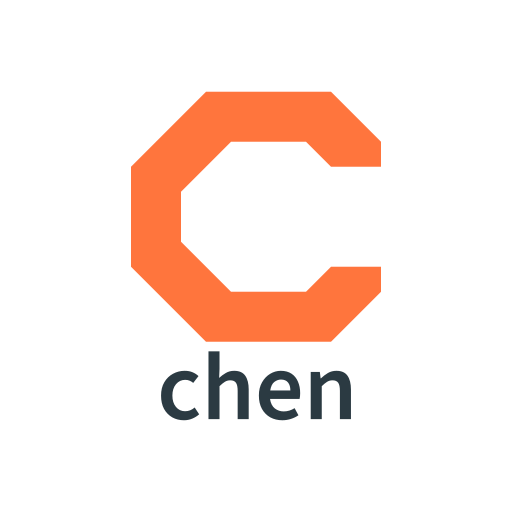

# chen

Code Hierarchy Exploration Net (chen) is an advanced exploration toolkit for your application source code and its dependency hierarchy. This repo contains the source code for chen library.

## Requirements

- Java >= 21
- Minimum 16GB RAM

## Languages supported

- C/C++
- H (C/C++ Header and pre-processed .i files alone)
- Java (Requires compilation)
- Jar
- Android APK and split bundles (.apkm, .apks, .xapk). Requires Android SDK. Set the environment variable `ANDROID_HOME` or use the container image. Split bundles are unpacked and the apks that carry dalvik bytecode are analysed. The Android tagger passes attach semantic tags to reachable flows, including personally identifiable information, regulated data such as `pci-dss`, `gdpr`, and `phi-medical`, secrets, third party `tracker` SDKs, and network direction tags such as `service-egress`, `service-ingress`, and `on-device-ai`.
- JavaScript
- TypeScript
- Flow
- Python
- Python (Supports 3.x to 3.13)
- PHP (Requires PHP >= 7.4. Supports PHP 7.0 to 8.4 with limited support for PHP 5.x)
- Ruby (Requires Ruby 3.4.7. Supports Ruby 1.8 - 3.4.x syntax)

## Data-flow engine

`dataflowengineoss` ships two interchangeable reaching-definitions solvers:

- **Flux** (`FluxSolver`) — the default. A low-allocation, array + in-place-bitset worklist solver
  that produces the same `REACHING_DEF` edges as the classic engine while using far less memory and
  GC time on large (e.g. bundled/transpiled JavaScript) methods. It uses copy-on-write definition
  sets so unchanged nodes share state rather than each allocating a bitset.
- **Classic** (`DataFlowSolver`) — the original map-based fixpoint solver, retained as the
  intra-procedural kernel and for A/B comparison.

Downstream tools select the engine through `EngineConfig.useFluxEngine` / the data-dependency pass;
in [atom](https://github.com/AppThreat/atom) the Flux engine and per-file fragment caching are on by
default, and `--legacy-dataflow` switches back to the classic engine.

## Origin of chen

chen is a fork of the popular [joern](https://github.com/joernio/joern) project. We deviate from the joern project in the following ways:

- Keep the CPG implementation at 1.0 based on the original paper.
- Enable broader hierarchical analysis (Application + Dependency + Container + OS layer + Cloud + beyond)

We don't intend for bug-to-bug compatibility and often rewrite patches to suit our needs. We also do not bring features and passes that do not add value for hierarchical analysis.

## License

Apache-2.0

## Enterprise support

Enterprise support including custom language development and integration services is available via AppThreat Ltd.

## Sponsors

YourKit supports open source projects with innovative and intelligent tools for monitoring and profiling Java and .NET applications.
YourKit is the creator of <a href="https://www.yourkit.com/java/profiler/">YourKit Java Profiler</a>, <a href="https://www.yourkit.com/dotnet-profiler/">YourKit .NET Profiler</a>, and <a href="https://www.yourkit.com/youmonitor/">YourKit YouMonitor</a>.

