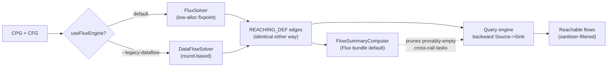

# Flux vs. the Classic OSS Data-Flow Engine

This document compares the two reaching-definitions solvers that ship in chen: the original
`DataFlowSolver` (referred to here as the _classic_ engine) and the newer `FluxSolver` (the
_Flux_ engine). It is written for compiler engineers who care about the lattice formulation and
the allocation behaviour of the fixpoint loop, and for security analysts who need to understand
what changes (and what provably does not) when atom switches engines under their flows.

The short version: Flux and the classic engine compute the _same_ reaching-definition edges. They
differ only in how the fixpoint is reached and how much memory that costs. On top of that shared
foundation, chen layers a backward query engine and an optional interprocedural summary engine.
Flux also opens the door to overflowdb2's mini-graph fragments, which is where the longer-term
incremental story lives.

## 1. Where the engines sit

It helps to separate two layers that both get called "the data-flow engine":

1. **Construction layer** (`dataflowengineoss/.../passes/reachingdef/`). A forward Meet-Over-all-Paths
   solve that produces the `REACHING_DEF` edges of the CPG. The classic `DataFlowSolver` and the
   `FluxSolver` are interchangeable here. This is the only place the two differ.
2. **Query layer** (`dataflowengineoss/.../queryengine/`). A backward Source to Sink explorer that
   walks the `REACHING_DEF` edges built in layer 1. The optional summary engine
   (`queryengine/summaries/`) prunes work here.

```
                 atom enhanceCpg                          atom reachables / data-flow
                       |                                            |
        +--------------v--------------+              +--------------v---------------+
        |  Construction layer         |              |  Query layer                 |
        |  (forward MOP solve)        |   REACHING_  |  (backward Source->Sink DFS) |
        |                             |   DEF edges  |                              |
        |  ReachingDefProblem.create  +------------->|  Engine + TaskSolver         |
        |    |                        |              |    |                         |
        |    +-- DataFlowSolver  (classic)           |    +-- FlowSummaryComputer   |
        |    +-- FluxSolver      (new)               |        (optional pruning)    |
        +-----------------------------+              +------------------------------+
```

There is a single `useFluxEngine` flag, on `OssDataFlowOptions`, which selects the construction-layer
solver and is the subject of this document. (An earlier query-layer `EngineConfig.useFluxEngine` flag
was a no-op — a shared cross-sink cache behind it proved unsound — and has been removed; cross-sink
reuse now lives only in the summary engine via `EngineConfig.useSummaries`.)

## 2. The shared lattice framework

Both solvers consume the identical problem built by `ReachingDefProblem.create(method)`
(`passes/reachingdef/ReachingDefProblem.scala`). This is a textbook monotone framework:

- **Lattice**: the powerset of definitions, ordered by subset. A _definition_ is just an integer.
- **Transfer function** per node `n`: `out(n) = gen(n) union (in(n) minus kill(n))`.
- **Meet** at a join: `in(n) = union of out(p) for all p in pred(n)`. Set union is the join in the
  powerset lattice.
- **Fixpoint**: iterate until no `out` set changes. Termination is guaranteed by the finite height
  of the lattice.

The element type is `mutable.BitSet`, and the crucial detail is how definitions become integers.
`ReachingDefFlowGraph` assigns every CFG node a dense integer through
`nodeToNumber: Map[StoredNode, Int]`. A `Definition` _is_ that node number, so an entire set of
reaching definitions is a `BitSet` of node numbers. This dense numbering is what later lets Flux
swap maps for arrays.

The flow graph also promotes method parameters (`MethodParameterIn`/`MethodParameterOut`), the
`METHOD` entry, and `METHOD_RETURN` into first-class CFG nodes with synthetic edges, so taint can
enter and leave a method cleanly.

```
  gen(n)   : definitions created at n (params define themselves; calls define
             their result and their Call/Identifier arguments; field accesses excluded)
  kill(n)  : other definitions of the same variable that n overwrites
  out(n)   = gen(n) union (in(n) minus kill(n))
```

`OptimizedReachingDefTransferFunction` adds the _lone identifier optimization_: an identifier used
exactly once is dropped from `gen` so it need not propagate through the whole graph;
`DdgGenerator` instead wires it straight to the exit. Both solvers inherit this for free because it
lives in the transfer function, not the solver.

## 3. The classic engine: `DataFlowSolver`

Source: `passes/reachingdef/DataFlowSolver.scala`. The forward solve is a round-based worklist over
nodes seeded in reverse post-order:

```scala
var out = problem.inOutInit.initOut      // initially gen(n) for each n
var in  = problem.inOutInit.initIn       // initially empty
var workList = ListBuffer ++= flowGraph.allNodesReversePostOrder
while workList.nonEmpty:
  val newEntries = workList.flatMap { n =>
    val inSet = pred(n).map(out).reduceOption(meet).getOrElse(empty)
    in += n -> inSet
    val newSet = transferFunction(n, inSet)   // gen(n) union (inSet minus kill(n))
    val changed = !old.equals(newSet)
    out += n -> newSet
    if changed then succ(n) else List()
  }
  workList = newEntries.distinct
```

This is correct and easy to reason about, but every detail of it allocates:

- `in` and `out` are immutable `Map[Node, BitSet]` rebuilt with `+=` on every update.
- The transfer function produces a fresh `BitSet` (`gen union (x minus kill)`) for every node on
  every visit, even when nothing changed.
- Each round ends with a `.distinct` pass over the worklist.

On small and medium methods this is fine. On the pathological methods that transpiled or bundled
JavaScript produces (single functions with tens of thousands of CFG nodes), the per-visit BitSet
churn and map rebuilds dominate, and the solve can drive the JVM into GC thrash or out of memory.
That pressure is the entire reason Flux exists.

The pass driving this is `ReachingDefPass`, a `ForkJoinParallelCpgPass[Method]`. Per method it
calls `ReachingDefProblem.create`, checks `shouldBailOut` (skip if the method exceeds
`maxNumberOfDefinitions`, default 2000 in atom, 4000 in the library), solves, then hands
`Solution.in` to `DdgGenerator.addReachingDefEdges`.

## 4. The Flux engine: `FluxSolver`

Source: `passes/reachingdef/FluxSolver.scala`, driven by `FluxReachingDefPass.scala`. Flux is a
drop-in replacement. It calls the identical `ReachingDefProblem.create`, the identical
`shouldBailOut`, and the identical `DdgGenerator`. Only the fixpoint loop changes, so the
`REACHING_DEF` edges it emits are byte-for-byte identical to the classic engine's.

### Why identical output is guaranteed

The reaching-def lattice is a powerset and the meet is set union. That makes the framework
monotone and _distributive_, and for a distributive framework the least fixpoint is independent of
the order in which the worklist visits nodes. So an in-place bitset worklist reaches exactly the
same `in`/`out` assignment as the round-based solver. Because `DdgGenerator` reads only
`Solution.in`, keyed over `allNodesReversePostOrder`, the downstream edges are identical. This is
not a heuristic approximation; it is the same fixpoint reached more cheaply.

### The low-allocation design

`FluxSolver.calculateMopSolutionForwards` is specialized to `(StoredNode, mutable.BitSet)` and
leans entirely on the dense node numbering from section 2:

- **Dense arrays indexed by node number** replace the maps: `gen`, `kill`, `out: Array[BitSet]`,
  `isRpo: Array[Boolean]`, and adjacency precomputed as `preds`/`succs: Array[Array[Int]]`. Inside
  the loop there are no map lookups, only array indexing.
- **Copy-on-write `out`**: `out(i)` starts as the _shared_ `gen(i)` reference and is only replaced
  when its value actually changes. Most transpiled-JS nodes have an empty `gen` and never change,
  so they keep sharing one set instead of each allocating an empty BitSet.
- **A single reusable scratch BitSet** is mutated in place per node:

```scala
scratch.clear()
for p in preds(idx): scratch |= out(p)    // in(idx) = union of out over preds
scratch &~= kill(idx)                      // minus kill
scratch |= gen(idx)                        // union gen
if scratch != out(idx):
  out(idx) = scratch.clone()               // only changed nodes allocate
  for s in succs(idx):
    if isRpo(s) && !inQueue(s) then enqueue(s)
```

- **The worklist** is a `mutable.ArrayDeque[Int]` with an `inQueue: Array[Boolean]` membership
  guard, which replaces the classic `.distinct`. It is seeded in reverse post-order and only
  processes reachable (RPO) nodes, matching the classic `in` key set exactly.
- **Materialization sharing**: when the final `in` map is built, a node with a single predecessor
  returns that predecessor's `out` _by reference_ (mirroring how the classic `reduceOption(meet)`
  returns a single set by reference). Long linear chains then share one BitSet, and only joins with
  two or more predecessors allocate. A naive fresh-copy-per-node materialization would itself OOM,
  so this detail matters.

Net effect: the steady-state fixpoint loop performs zero allocation, peak memory tracks the classic
engine rather than exceeding it, and the result is identical. Flux is aimed squarely at the large
methods where the classic engine struggles.

```
  Classic round-based                         Flux in-place worklist
  -------------------                         ----------------------
  Map[Node,BitSet] in/out                     Array[BitSet] out, dense by node number
  fresh BitSet per node per visit             one reusable scratch BitSet
  .distinct over worklist each round          ArrayDeque[Int] + inQueue[] guard
  reduceOption(meet) over preds               scratch |= out(p) in place
  allocation grows with revisits              steady state allocates nothing
```

## 5. How atom selects and configures the engine

Flux is the **default** in atom. There is no `--flux` flag; instead `--legacy-dataflow` opts out:

```scala
// atom Atom.scala
config.withUseFluxEngine(false).withCacheFragments(false)   // --legacy-dataflow
```

Relevant atom defaults (`atom/package.scala`):

```scala
var useFluxEngine: Boolean  = true     // Flux is the default solver; also enables flow summaries
var cacheFragments: Boolean = true     // overflowdb2 mini-graph fragment caching
var validationConfigFile: Option[File] = None   // --validation-config
```

The selection happens in `OssDataFlow.create`, which constructs `FluxReachingDefPass` when
`useFluxEngine` is set and `ReachingDefPass` otherwise. Both run inside the `dataflowOss` overlay
during `enhanceCpg`:

```scala
new OssDataFlow(new OssDataFlowOptions(
  maxNumberOfDefinitions = x.maxNumDef,    // --max-num-def, default 2000
  useFluxEngine          = x.useFluxEngine
)).run(new LayerCreatorContext(atom))
```

Other knobs that shape the solve and the downstream query:

| Flag                  | Default | Effect                                                                      |
| --------------------- | ------- | --------------------------------------------------------------------------- |
| `--legacy-dataflow`   | off     | Force classic `DataFlowSolver`, disable fragment caching and flow summaries |
| `--max-num-def <n>`   | 2000    | Per-method reaching-def bailout threshold (`shouldBailOut`)                 |
| `--validation-config` | none    | JSON of sanitisers/validators (chennai.json schema)                         |
| `--slice-depth <n>`   | 7       | Backward query slice depth for data-flow / reachables                       |

Note that atom does not surface `EngineConfig.maxCallDepth` (default 3) or the argument-expansion
limits as CLI flags; those are query-layer bounds set in chen.

## 6. The query layer and where sanitisers live

Once the `REACHING_DEF` edges exist (built by either solver), the backward explorer in
`queryengine/Engine.scala` runs Source to Sink. It creates one `ReachableByTask` per sink, submits
them to a virtual-thread-per-task executor, and expands backward over incoming `REACHING_DEF`
edges. `TaskSolver` performs the intra-procedural DFS; when it reaches a parameter or an unmodeled
internal call it emits a _partial_ result that becomes a cross-procedure follow-up task, giving the
k-limited interprocedural search (`maxCallDepth`, default 3).

Sanitisers and validators are **not** part of the solver. They are path filters applied to the
results, keyed on tags that `ChennaiTagsPass` writes:

```scala
flows.doesNotPassThrough(n => sanitizerIds.contains(n.id))
flows.passesThrough(_.tag.name("sink").nonEmpty)
```

`ChennaiTagsPass` reads the `--validation-config` JSON. A sanitiser entry names method patterns and
the sink categories it covers:

```json
{
  "sanitizers": [
    {
      "name": "owasp-encode",
      "methods": ["org\\.owasp\\.encoder\\.Encode\\..*"],
      "categories": ["http"]
    }
  ]
}
```

Each matched call gets a `sanitizer` tag plus a `sanitizer-<category>` tag per category (an empty
`categories` list covers every category). `ReachableSlicing.isSanitized` then drops a flow when a
path element is a sanitiser whose categories intersect the sink's categories. Two companion taggers
feed the source and sink sets: `PiiTagsPass` (tags PII/PCI/secrets as sources) and
`TrackersTagsPass` (tags analytics and ad SDKs as exfiltration sinks). All three are independent of
which solver built the DDG.

## 7. The summary engine, and how it relates to Flux

Method flow summaries are an interprocedural pruning mechanism that lives in the _query_ layer. They
are part of the default Flux bundle in atom (on whenever the Flux engine is, disabled together with
it by `--legacy-dataflow`; there is no separate flag). Despite the shared "flux/CHEN3" lineage the
mechanism is distinct from the `FluxSolver`: Flux speeds up DDG _construction_, while summaries prune
the Source to Sink _search_.

A `MethodFlowSummary` (`queryengine/summaries/MethodFlowSummary.scala`) is a context-independent
fact about one method expressed over formal parameter positions, so it is reusable at every call
site:

```scala
case class MethodFlowSummary(
  methodFullName: String,
  paramToReturn: Set[Int],              // params whose value can reach the return
  paramToParamOut: Map[Int, Set[Int]],  // param -> output params it mutates
  returnFromInternal: Boolean,          // return tainted by a body-internal origin
  paramOutFromInternal: Set[Int])
```

When `returnTaintable` is false, the return is provably taint-free and the query never enters the
callee. Because summaries only ever remove provably-empty work, the set of reported flows is
unchanged. `FlowSummaryComputer.computeAll` builds them callee-before-caller: it forms the call
graph over internal methods, computes strongly connected components, topologically sorts the
condensation and reverses it, then iterates each recursive component to a fixpoint (terminating
because summaries only grow). The summaries are derived from the _same_ `REACHING_DEF` edges that
the classic or Flux solver produced, then persisted both as CPG-native `flow-summary` tags on the
`METHOD` nodes (`FlowSummaryTagsPass`) and as a JSON sidecar next to the atom (`FlowSummaryStore`).



## 8. The overflowdb2 foundation under Flux

Flux's dense-array, primitive-id approach is a natural fit for overflowdb2's storage model, and the
`cacheFragments` default (also disabled by `--legacy-dataflow`) hints at where this is going.

- **Packed adjacency** (`overflowdb/AdjacentNodes.java`): edges are virtual. A node's neighbours of
  a given label and direction are a contiguous slice of one flat `Object[]`, located by an
  adaptively-sized primitive offset array (`byte[]` widening to `short[]`/`int[]`). Iterating
  successors or predecessors is array-walking with no per-edge allocation, and node identity is a
  stable `long`. This is exactly the shape Flux wants for its `preds`/`succs` arrays.
- **Algorithm library** (`overflowdb/algorithm/`): dominators and post-dominators (Lengauer-Tarjan),
  strongly connected components (iterative Tarjan), topological sort (Kahn), and context-sensitive
  reachability all take an injected successor function and key their internal state on primitive
  `long` ids via GNU Trove maps. The SCC and topological-sort primitives are precisely what
  `FlowSummaryComputer` uses for its callee-first ordering.
- **Fragments / mini-graphs** (`overflowdb/storage/GraphFragmentCodec.java`): an add-only, dictionary
  -compressed, CRC- and schema-guarded byte blob that captures a self-contained slice of the graph.
  Nodes are renumbered to dense local ids; edges that leave the slice are recorded as `SymbolicKey`
  boundary references. `BatchedUpdate.applyFragment` re-materializes a fragment into another graph,
  resolving boundary keys to live nodes. This is the substrate for caching and incrementally
  re-stitching reaching-def results across runs, which is where the construction layer is headed
  once fragment caching is fully wired through.

```
   Main CPG                         Fragment (add-only blob)
   --------                         ------------------------
   node id 90817  (METHOD foo) ---> export  key="foo"        local 0
   node id 90820  (CALL bar)   ---> edge local 0 -> local 1
   node id 90999  (external)   ---> boundary ref key="bar"   (re-resolved on apply)
```

## 9. Practical guidance

- **Leave Flux on.** It is the default, produces identical edges, and is the only engine that
  reliably finishes on large transpiled-JS and bundled code. Reach for `--legacy-dataflow` only to
  reproduce an older result or to isolate a suspected solver bug, and expect higher memory use.
- **A flow that appears under Flux but not under the classic engine (or vice versa) is a bug**, not
  a tuning difference. The two solvers are provably equivalent on this lattice, so a divergence
  points at something outside the solver: a bailout via `maxNumberOfDefinitions`, a tagging
  difference, or nondeterminism in a different pass.
- **Tune reachability separately from construction.** If you have too few or too many flows, the
  levers are `--slice-depth`, the source/sink tags, and the `--validation-config` sanitisers. None of
  those change what the reaching-def solver computes; they change what the backward query reports.
- **Method flow summaries are on by default** (part of the Flux bundle, disabled only by
  `--legacy-dataflow`). They only remove provably-empty cross-call work, so they cannot drop a real
  flow, and they are cached across runs (as `flow-summary` METHOD tags and a JSON sidecar).

## 10. Key source locations

| Concern                     | File                                                                                                               |
| --------------------------- | ------------------------------------------------------------------------------------------------------------------ |
| Classic solver              | `dataflowengineoss/.../passes/reachingdef/DataFlowSolver.scala`                                                    |
| Flux solver                 | `dataflowengineoss/.../passes/reachingdef/FluxSolver.scala`                                                        |
| Pass wiring                 | `passes/reachingdef/{ReachingDefPass,FluxReachingDefPass}.scala`                                                   |
| Shared problem / flow graph | `passes/reachingdef/{DataFlowProblem,ReachingDefProblem}.scala`                                                    |
| Overlay + options           | `dataflowengineoss/.../layers/dataflows/OssDataFlow.scala`                                                         |
| Query engine                | `dataflowengineoss/.../queryengine/{Engine,TaskSolver,TaskCreator}.scala`                                          |
| Summaries                   | `queryengine/summaries/{MethodFlowSummary,FlowSummaryComputer,FlowSummaryStore}.scala`                             |
| Taggers                     | `platform/frontends/x2cpg/.../passes/taggers/{ChennaiTagsPass,PiiTagsPass,TrackersTagsPass}.scala`                 |
| atom CLI wiring             | `atom/Atom.scala`, `atom/package.scala`, `atom/slicing/ReachableSlicing.scala`                                     |
| odb2 adjacency / fragments  | `overflowdb/AdjacentNodes.java`, `overflowdb/storage/GraphFragmentCodec.java`                                      |
| odb2 algorithms             | `overflowdb/algorithm/{DominatorTree,StronglyConnectedComponents,TopologicalSort,ContextSensitivePathFinder}.java` |

</content>
</invoke>
